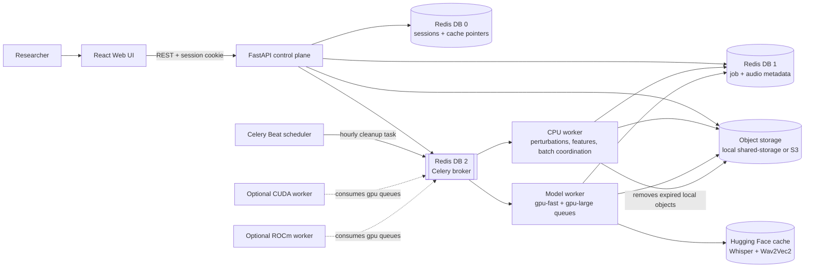
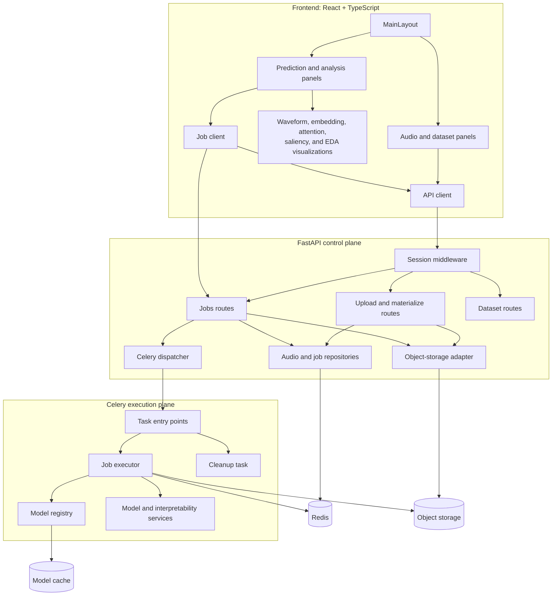

# ECHO Runtime Architecture

ECHO uses FastAPI as a CPU-only control plane and Celery workers as the model
execution plane. The frontend communicates only with FastAPI.

## UML diagrams

### System architecture



### Application components



### Asynchronous job lifecycle

```mermaid
sequenceDiagram
    actor User as Researcher
    participant UI as React UI
    participant API as FastAPI
    participant Meta as Redis metadata
    participant Broker as Celery broker
    participant Worker as Celery worker
    participant Storage as Object storage
    participant Models as Model services

    User->>UI: Upload audio
    UI->>API: POST /upload
    API->>Storage: Store audio under opaque key
    API->>Meta: Save session-owned audio metadata
    API-->>UI: audio_id

    User->>UI: Request analysis
    UI->>API: POST /jobs
    API->>Meta: Validate ownership; create queued job
    API->>Broker: Publish task envelope to routed queue
    API-->>UI: 202 Accepted + job_id

    loop Until job is terminal
        UI->>API: GET /jobs/{job_id}
        API->>Meta: Read authorized job status
        API-->>UI: Status and progress
    end

    Broker->>Worker: Deliver task
    Worker->>Meta: Mark started / processing
    Worker->>Storage: Download audio to temporary directory
    Worker->>Models: Load model if necessary; run operation
    Models-->>Worker: Analysis result
    Worker->>Storage: Store result artifact
    Worker->>Meta: Mark success with result key
    UI->>API: GET /jobs/{job_id}/result
    API->>Storage: Read authorized result
    API-->>UI: Result JSON
```

The editable PlantUML sources below mirror the rendered diagrams and are kept
alongside the architecture notes for environments that use PlantUML directly.

- [System deployment diagram](docs/uml/system-deployment.puml)
- [Application component diagram](docs/uml/application-components.puml)
- [Asynchronous job sequence diagram](docs/uml/async-job-sequence.puml)

See [the UML source guide](docs/uml/README.md) for rendering instructions.

## Request flow

1. `POST /upload` validates audio, stores it through the object-storage adapter,
   registers a session-owned opaque `audio_id`, and returns without inference.
2. `POST /jobs` validates an operation and its audio ownership, stores a transient
   job record, and publishes a small task envelope containing storage keys.
3. A worker downloads audio to a per-task temporary directory, lazily loads the
   required model, executes the operation, and stores the structured result.
4. The frontend polls `GET /jobs/{job_id}` and retrieves completed output from
   `GET /jobs/{job_id}/result`.

Job and audio metadata expire after 24 hours. Local object cleanup is performed
by Celery Beat; production S3 buckets must apply a matching lifecycle rule.

## Runtime boundaries

- `api`: FastAPI, session validation, upload validation, job authorization, and
  result proxying. It has no PyTorch or Transformers dependency.
- `worker-cpu`: CPU-only perturbation, feature, projection, and maintenance work.
- `worker-model-local`: development model worker consuming GPU queues on CPU.
- `worker-gpu` / `worker-amd`: optional CUDA/ROCm workers consuming `gpu-fast`
  and `gpu-large`, with concurrency one per GPU.
- `scheduler`: Celery Beat for transient-object maintenance.
- `redis`: separate logical databases for sessions/cache, job metadata, broker,
  and Celery results, configured with persistence and `noeviction`.
- `ObjectStorage`: shared filesystem locally or an S3-compatible bucket in
production. Clients and queue messages never receive storage keys.

Apply `Backend/s3-lifecycle.json` to the production bucket so transient
uploads, cache objects, generated audio, and result artifacts expire after
24 hours.

## Operations and routing

| Queue | Operations |
| --- | --- |
| `gpu-fast` | Whisper Base, Wav2Vec2, and embeddings |
| `gpu-large` | Whisper Large, attention, and saliency |
| `cpu` | Perturbations, audio features, projections, and cleanup |

The worker-owned model registry keys entries by model, purpose, revision, and
device. Standard, attention, saliency, and embedding variants can therefore be
loaded and evicted independently.

## Production configuration

Set `STORAGE_BACKEND=s3` and configure the `S3_*` settings for both API and
workers. Use private authenticated Redis endpoints for `JOB_REDIS_URL`,
`CELERY_BROKER_URL`, and `CELERY_RESULT_BACKEND`; an evicting cache may use a
separate `REDIS_URL`. Keep `ENABLE_LEGACY_SYNC_INFERENCE=false`.
